# Credit-Risk-Prediction-using-Explainable-AI

## in this project we predict the likelihood of credit default , while applying explainable AI techniques like LIME and SHAP for transparent decision-making

## 📁 Table of Contents

- [Project Overview](#project-overview)
- [Data Description](#data-description)
- [EDA Summary](#eda-summary)
- [Data Preprocessing](#data-preprocessing)
- [Dimensionality Reduction](#dimensionality-reduction-interpretability-vs-performance)
- [Model Training Overview](#model-training-overview)
- [Model Explainability](#model-explainability)
- [Results & Insights](#results--insights)
- [Installation](#installation)

---

## Project Overview

This project focuses on predicting the likelihood of a customer defaulting on a loan by leveraging historical credit data, with a strong emphasis on **explainability** and **fairness**. Traditional credit scoring models often function as black boxes, leading to challenges in transparency and accountability.

To address this, we employ interpretable machine learning techniques such as **SHAP (SHapley Additive exPlanations)** and **LIME (Local Interpretable Model-agnostic Explanations)** to provide clear insights into model decisions. Furthermore, the project focuses to mitigate potential biases related to sensitive attributes like gender or age.

By balancing predictive performance with interpretability and ethical considerations, the project aims to support responsible decision-making in **credit risk assessment**.

---

## Data Description

The **Default of Credit Card Clients Dataset** is sourced from the [UCI Machine Learning Repository](https://archive.ics.uci.edu/ml/datasets/default+of+credit+card+clients) and contains information on the **credit history and behavior** of 30,000 credit card holders in Taiwan.

---

### Dataset Overview

- **Source**: UCI Machine Learning Repository
- **Original Provider**: Taiwan Economic Journal
- **Published By**: Yeh, I.C., & Lien, C.H. (2009)
- **Number of Instances**: 30,000
- **Number of Features**: 23
- **Prediction Target**: default.payment.next.month (1 = default, 0 = no default)

---

### Feature Details

| Column Name                | Description                                                                                          |
| -------------------------- | ---------------------------------------------------------------------------------------------------- |
| ID                         | Unique ID for each client                                                                            |
| LIMIT_BAL                  | Amount of given credit (NT dollar): includes individual and family credit                            |
| SEX                        | Gender (1 = male, 2 = female)                                                                        |
| EDUCATION                  | Education level (1 = graduate school, 2 = university, 3 = high school, etc.)                         |
| MARRIAGE                   | Marital status (1 = married, 2 = single, 3 = others)                                                 |
| AGE                        | Age in years                                                                                         |
| PAY_0 to PAY_6             | Repayment status in months from September to April (0 = paid, 1 = delay 1 month, ..., -1 = pay duly) |
| BILL_AMT1 to BILL_AMT6     | Bill statement amount (NT dollar) from September to April                                            |
| PAY_AMT1 to PAY_AMT6       | Amount paid in previous months (NT dollar) from September to April                                   |
| default.payment.next.month | Target variable (1 = default, 0 = no default)                                                        |

---

### Key Characteristics

- **Multivariate**: Numeric + categorical features
- **Supervised Classification**: Predict default (yes/no)
- **Real-world Financial Data**
- **Moderate class imbalance**: ~22% defaulted clients

### Download

- [Direct Dataset Link (CSV)](https://archive.ics.uci.edu/ml/machine-learning-databases/00350/default%20of%20credit%20card%20clients.xls)

---

## EDA Summary

### 1. Class Distribution

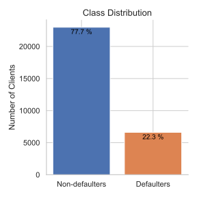

The dataset exhibits a significant class imbalance — only **20%** of records belong to the default class, while the remaining **80%** are non-default. This imbalance can negatively impact model performance, especially for minority class predictions. To address this, we later apply resampling techniques like **SMOTE** to balance the classes.

---

### 2. Categorical Feature Distributions


The data reveals several interesting patterns:

- **Gender:** The default rate is noticeably higher among **male** clients than females.
- **Education Level:** Higher education levels appear to correlate with a **lower risk of default**.
- **Marital Status:** **Married individuals** show a slightly elevated risk of default compared to single clients.

However, these observations may be **coincidental** and not necessarily indicative of true associations. To verify the statistical significance of these relationships, we conduct a **Chi-Square Test of Independence**.

#### Chi-Square Test of Independence

**Hypotheses:**

- **Null Hypothesis (H₀):**  
  There is no association between the categorical variable (e.g., education level) and loan default status; any variation is due to chance.

- **Alternative Hypothesis (H₁):**  
  There is a significant association between the categorical variable and default status; observed differences are not random.

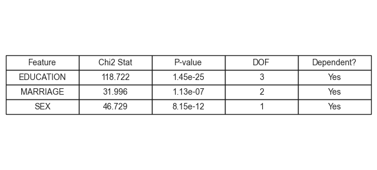

The test results help determine which categorical features are statistically relevant for predicting credit risk.

---

### 3. Payment Status Distribution

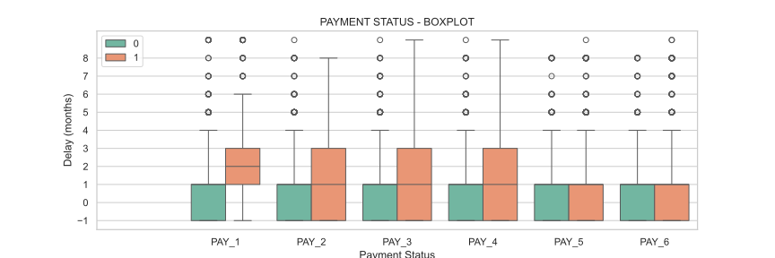

Boxplots and count plots for monthly **payment status (PAY_0 to PAY_6)** highlight important trends:

- Clients with **delays of one month or less** are much less likely to default.
- Among all months, **September (PAY_1)** demonstrates the highest discriminative power in identifying defaulters.

This makes PAY_1 a **key feature** in predicting credit default risk and justifies its priority in model training and feature selection.

### 4. Correlation Analysis

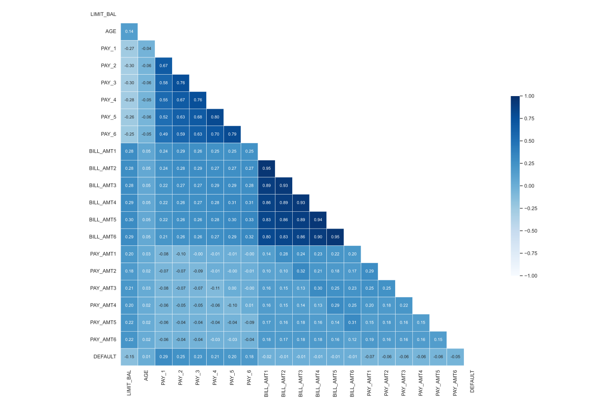

There is a strong positive correlation between:

- **Billing amounts (BILL_AMTn)**
- **Payment statuses (PAY_n)**

This may suggest **redundant information** across these features. As a result, **PCA (Principal Component Analysis)** or **feature selection techniques** may be applied to reduce dimensionality and multicollinearity.

---

### 5. Credit Limit vs. Default

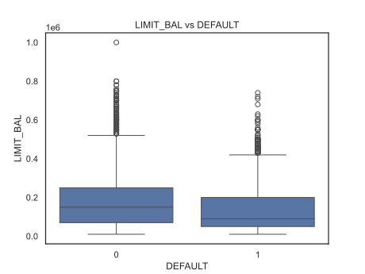

Although defaulters tend to have a **lower mean credit limit**, the distributions of credit limit for defaulters and non-defaulters **overlap significantly**. Therefore:

- **Credit Limit alone** is not a strong predictor.
- However, it may still be useful **when combined** with other features.

---

### 6. Age Distribution


The **age range of 30–40** shows a **higher density of defaulters** compared to other age groups. This indicates a potential **risk band** that could enhance model performance when captured properly.

---

### 7. Monthly Payment Amounts

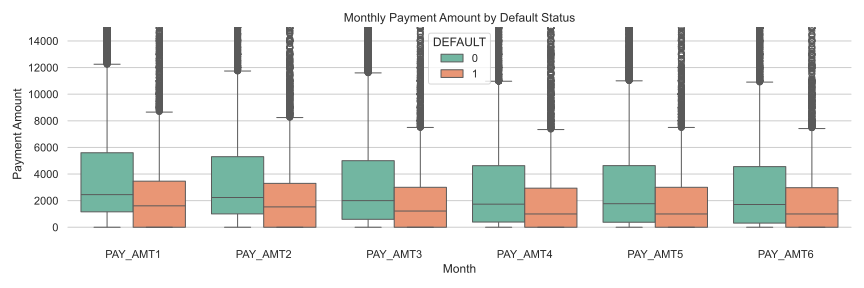

### Monthly Payment Amount and Default Status

Boxplots of monthly payment amounts (PAY_AMT1 to PAY_AMT6) indicate:

- **Non-defaulters** typically make **higher payments** across all months.
- Median payment amounts are consistently **lower** among defaulters.
- There are many **outliers**, but the overall central tendency makes payment amount a useful predictor.

---

---

## Data Preprocessing

### Encoding & Splitting

- Applied **one-hot encoding** to convert categorical variables.
- Used a **1:4 stratified train-test split** to maintain class distribution.


### Feature Scaling

While tree-based models are scale-invariant, others benefit from scaling. Two methods were considered:

- **Normalization** (Min-Max Scaling):
  $$
  X_{norm} = \frac{X - X_{min}}{X_{max} - X_{min}}
  $$
- **Standardization** (Z-score Scaling):
  $$
  Z = \frac{X - \mu}{\sigma}
  $$

✅ Final choice: **Normalization**, due to better handling of outliers.  
📌 Scaling is applied **only on training data statistics** to prevent leakage.

### Handling Class Imbalances

Imbalanced datasets can cause models to become biased toward the majority class, leading to poor performance on the minority class. To address this, we applied the following resampling techniques:


#### 🔹 Cluster Centroid Undersampling (Undersampling)

This technique reduces the number of majority class samples by clustering them using KMeans and replacing them with the cluster centroids.

- ✅ Reduces class imbalance by shrinking the majority class size.
- ✅ Retains the structural distribution of the original data.
- 📌 Best used when the majority class is significantly overrepresented or contains redundant points.

#### 🔹 Simple SMOTE (Oversampling)

SMOTE creates new synthetic instances of the minority class by interpolating between a data point and one of its k nearest neighbors.

- ✅ Increases the size of the minority class to balance the dataset.
- ✅ Prevents overfitting caused by simple duplication.
- 📌 Effective when the minority class is well-distributed and not clustered.

### 🔹 KMeans-SMOTE (Oversampling)

This hybrid method first clusters the minority class using KMeans, then applies SMOTE within each cluster to generate synthetic samples.

- ✅ Produces more localized and realistic synthetic points.
- ✅ Captures internal structure of the minority class more effectively.
- 📌 Useful when the minority class has subgroups or complex distributions.

---

**Note**: We evaluated model performance using each resampling strategy to identify the most effective technique for improving minority class prediction. The final choice was based on validation metrics like F1-score and recall.

---

## Dimensionality Reduction: Interpretability vs Performance

While building our credit risk models, we evaluated two approaches for reducing the feature space, each with its own trade-off between **performance** and **interpretability**.

---

### Path 1: Feature Selection + SHAP (High Interpretability)

- We used methods like `SelectKBest` and `RFE` to retain **original, domain-relevant features**.
- These selected features were passed to models such as **Logistic Regression** and **XGBoost**.
- With this setup, **SHAP values directly mapped to the actual features**, offering **clear, regulator-friendly insights**.

✅ This approach worked best when **transparency and explainability** were our primary concerns.

---

### Path 2: PCA + SHAP

- Applied **Principal Component Analysis (PCA)** to reduce dimensionality on:
  ```python
  featuresToReduce = [f'PAY_{i}' for i in range(1, 7)] + \
                     [f'BILL_AMT{i}' for i in range(1, 7)] + \
                     [f'PAY_AMT{i}' for i in range(1, 7)]
  ```
- The **top 7 principal components** explained approximately **95% of the variance** in the original feature set.
  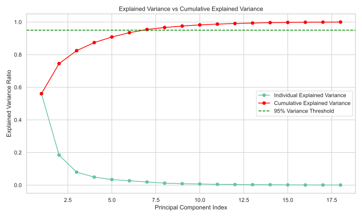

---

### Summary of Our Findings

#### **Feature Selection + SHAP**

- ✅ **Interpretability**: High — SHAP values directly align with original features.
- ⚪ **Model Performance**: Reasonable, with good transparency.
- ✅ **SHAP Clarity**: Immediate and intuitive.
- 📌 **Best Used When**: Regulatory compliance, stakeholder explanations, or early-stage data exploration are important.

#### **PCA + SHAP**

- ⚠️ **Interpretability**: Lower — components are harder to explain.
- ✅ **Model Performance**: Often higher due to variance capture.
- ⚠️ **SHAP Clarity**: Requires reverse mapping for explanation.
- 📌 **Best Used When**: Predictive accuracy is key, and some interpretability can be traded off.

---

📌 **What We Chose**: For generating **clear, actionable model explanations** using SHAP and LIME, we prioritized **feature selection** over PCA to maintain **interpretability without sacrificing too much performance**.

---

## Model Training Overview

### Models Trained

- **Logistic Regression**
- **Decision Tree**
- **Random Forest**
- **XGBoost**
- **Kernel Approximation SVM** (`RBFSampler + LinearSVC`)

> ℹ️ **Why Kernel Approximation SVM?**  
> Standard SVM with non-linear kernels (like RBF) is computationally expensive on large datasets.  
> Kernel Approximation SVM uses `RBFSampler` to approximate the RBF kernel, enabling the use of a faster `LinearSVC`, significantly improving scalability.

### Feature Selection

- Performed using `SelectFromModel` with a `RandomForestClassifier`.
- Retains only the most important features based on impurity-based importance.

### Hyperparameter Tuning

- Conducted using `GridSearchCV` with **3-fold cross-validation**.
- **F1 Score** used as the scoring metric to balance precision and recall due to class imbalance.
- No tuning performed for Kernel Approximation SVM (used fixed configuration).

### Evaluation Metrics

- **Accuracy**
- **Precision**
- **Recall**
- **F1 Score**

> **Why F1 Score?**  
> F1 Score was prioritized to handle class imbalance by balancing false positives and false negatives.

---

## Model Performance Visualization

Performance of each model across different class balancing techniques:

- **Logistic Regression**  
  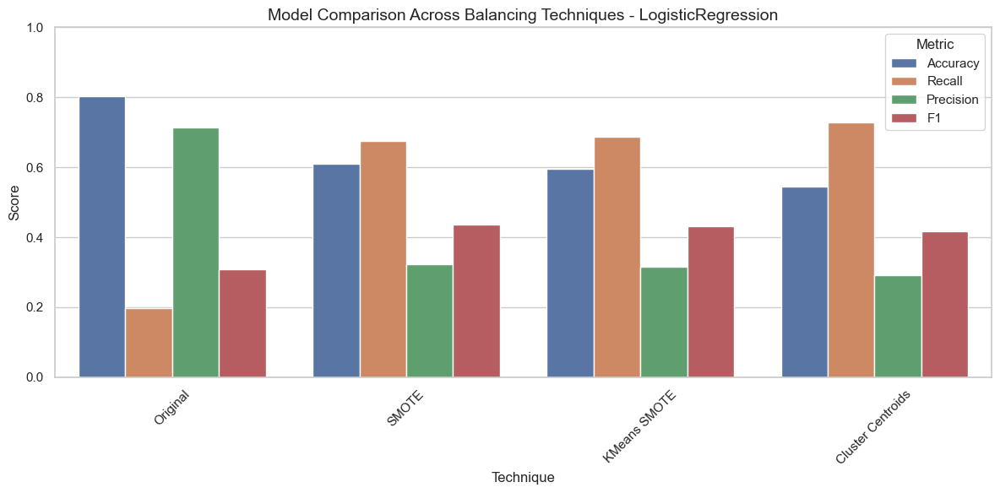

- **Decision Tree**  
  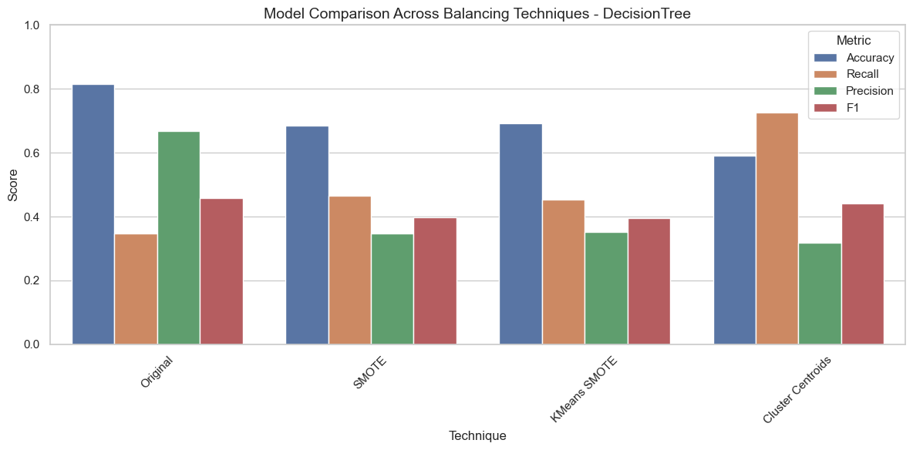

- **Random Forest**  
  

- **XGBoost**  
  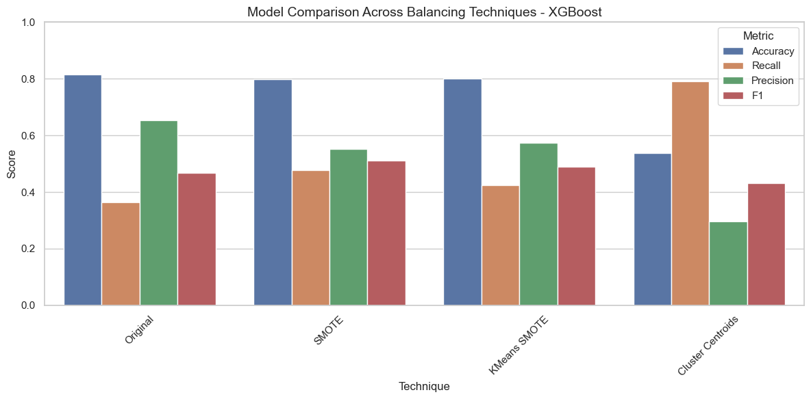

- **Kernel Approximation SVM**  
  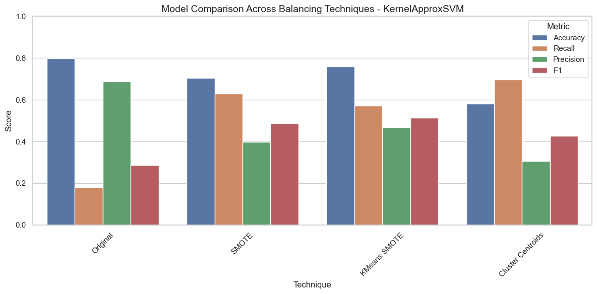

---
---

##  Model Explainability

To ensure transparent, trustworthy decision-making in credit risk assessment, we used two widely adopted **explainable AI (XAI)** techniques: **SHAP** and **LIME**. These tools help break down complex model behavior and explain individual and global predictions.

---

### 1. 🔍 SHAP (SHapley Additive exPlanations)

SHAP explains the model's predictions by assigning **each feature a contribution value** for every prediction. These values are based on **game-theoretic Shapley values**.

#### 🧮 Global Feature Importance

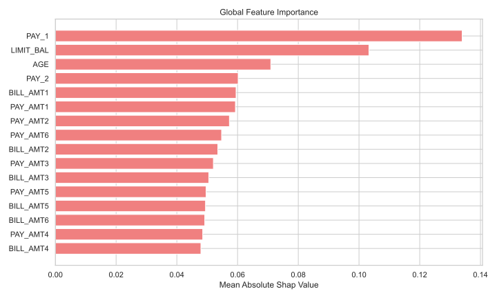

- This bar chart shows **mean absolute SHAP values**, which reflect how much each feature contributes to predictions across the dataset.
- **Key insights:**
  - `PAY_1`, `LIMIT_BAL`, and `PAY_AMT1` are the **most influential** features.
  - Features related to **payment history (PAY_1–PAY_6)** and **credit usage (LIMIT_BAL, BILL_AMTn)** dominate the importance list
  -model is not based on any biasis based on gender and education

---

### 2. 🧩 LIME (Local Interpretable Model-Agnostic Explanations)

While SHAP offers both global and local explanations, **LIME specializes in local interpretability**, helping to understand individual decisions.

#### 🧑 Local Explanation Example

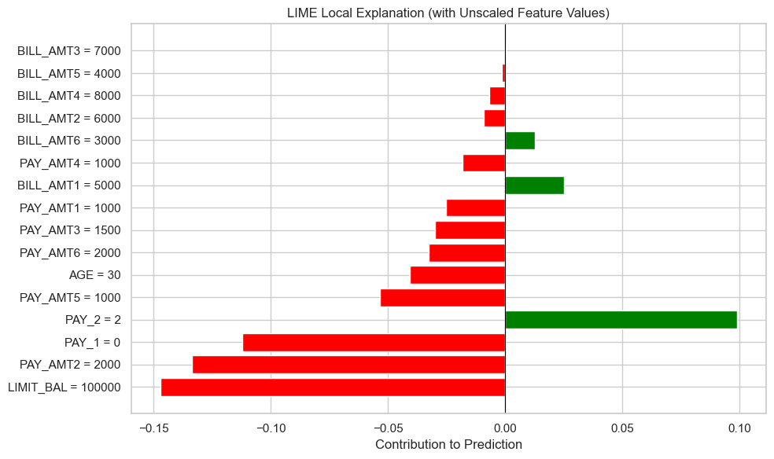

- This LIME explanation shows **how each feature affects a single customer's prediction**.
- Features pushing the model toward **default** are shown in **red**, and those pushing toward **non-default** are in **green**.
- This helps stakeholders and users **understand why a specific prediction was made**, especially in sensitive financial contexts.

---

### 3. 💧 SHAP Waterfall Plot: Individual Prediction Breakdown (XGBoost)

We also use **SHAP waterfall plots** to trace how an individual prediction is formed from base value to final output.

#### 📉 SHAP Waterfall Plot

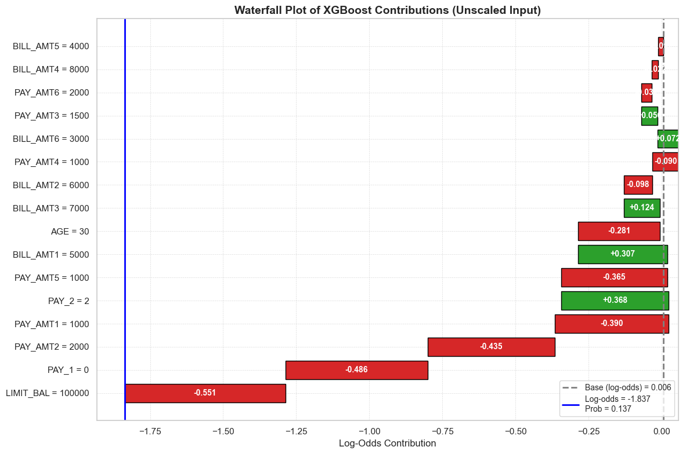

- This visualization starts at the **model’s base value** (average prediction).
- Each feature adds or subtracts from this baseline, showing their **directional impact**.
- For example:
  - `PAY_1` might **increase** the likelihood of default significantly.
  - `PAY_AMT1` or `LIMIT_BAL` might **reduce** it.

---

### ✅ Summary

| Technique        | Purpose                     | Advantage                                                   |
|------------------|-----------------------------|-------------------------------------------------------------|
| **SHAP**         | Global + Local Explanation  | Theoretically sound, interpretable for both data-wide and individual predictions |
| **LIME**         | Local Explanation           | Model-agnostic, helpful for user-level insights             |
| **Waterfall Plot** | Per-instance decision breakdown | Visualizes how each feature moves the prediction         |

These tools enable our model to be **interpretable, fair, and regulatory-compliant**, making it suitable for deployment in **real-world financial applications**.

---
##  Installation 
Follow the steps below to set up the project environment and run the application: 
### 1. Clone the Repository 
```bash 
git clone https://github.com/divyanshjain122/Credit-Risk-Prediction-using-Explainable-AI.git 
``` 
### 2. Install Dependencies 
Navigate into the project directory and install the required Python packages: 
```bash -->
cd Credit-Risk-Prediction-using-Explainable-AI
pip install -r requirements.txt 
``` 
### 3. Run the Streamlit Application 
Inside the project folder, launch the Streamlit app: 
```bash
streamlit run src/app.py 
``` 

